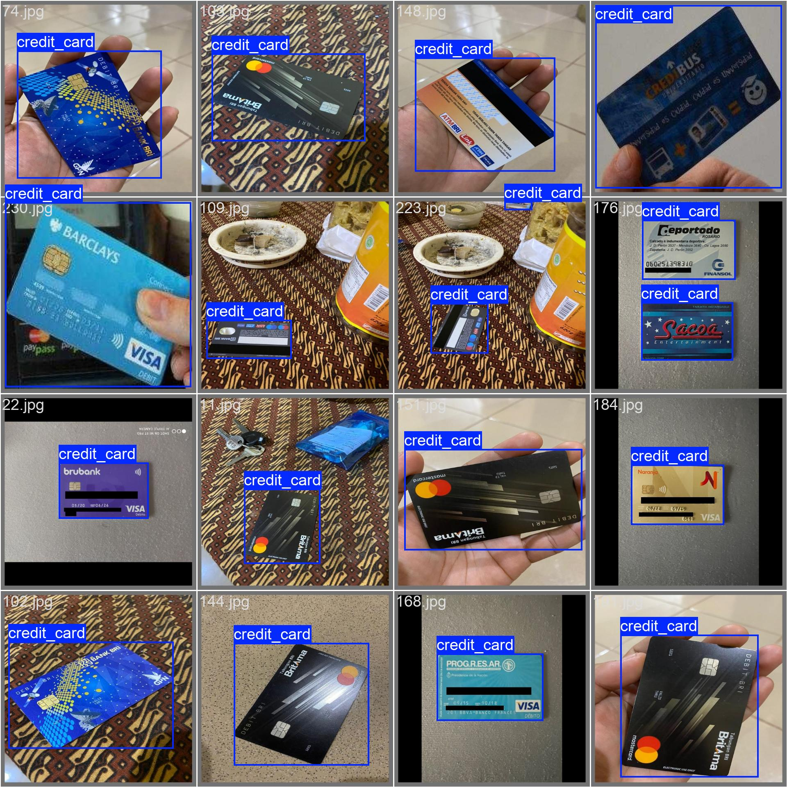
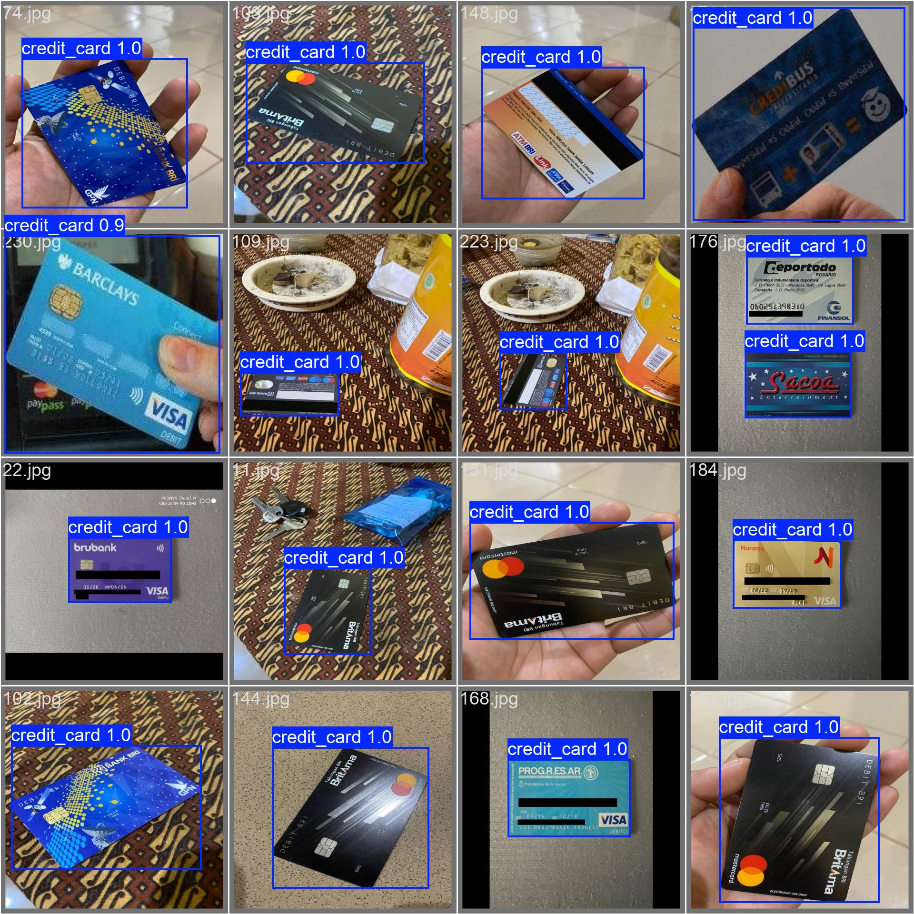

= **YOLOv10 Model Optimization for Credit Card Detector**

== **1. Introduction**

This report shows the process and results about **YOLOv10** Fine-Tunning for credit cards detections on images.
One of the main objectives of this project was to adapt **YOLOv10** model, that originally has not been trained to 
detect those credit cards, in order to find and locate credit cards in different conditions and environments.

To do this work I used a public dataset from link:https://universe.roboflow.com/efe-efesefe-gvfaz/credit-cards-n4hrw[RoboFlow]. 
Additionally, I added many other pictures about credit cards to the dataset. 

=== **1.1 Motivation**

The automatic credit cards detections on images have many practical applications, including:

* Improve the performance of link:https://github.com/nahueltabasso/credit-card-service[Credit-Card-Service V1.0.0] on inference over images
* Improve the security in financial transactions
* Automation of identity verification processes
* Assistance in the organization of financial documents
* Development of more efficient payment systems

**YOLOv10** is one of the most advanced and efficient object detection models in the world. It was chosen as the base for this project because of its accuracy and speed. This family of models are known for being able to detect objects in real time without the need of having large computing resources (Hardware). However, it is not pre-trained specifically to detect credit cards, so an adjustment was necessary to adapt it to this task since **YOLOv10** has been originally trained on a general data set (such as COCO or ImagenET).

This process of adaptation is known as Fine-Tunning, which involves re-training the model with a specific dataset (related to the task, in this case credit cards), allowing it to learn the unique characteristics of these objects.

=== **1.2 Context and Challenges**
 
The automatic credit card detection involves many challenges:

* **Variability in design:** credit cards can vary significantly in appearence depending on its issuer, type of card and region.
* **Light conditions:** cards can appear in different ligth conditions, from a brilliant light to deep shadows.
* **Partial occlusions:** in many cases, parts of the card may be hidden by other objects or by the hand holding it.
* **Angles and perspectives:** cards can be taken from different angles and perspectives altering the appareance.
* **Complex Backgrounds:** cards can appear over a big variety of backgrounds, from smooth surfaces to textured environments.

== **2 Metodology**

=== **2.1 Data Set**

* **Size of dataset:** The dataset used for this Fine-Tunning has a 353 images, 300 of these were obtained from link:https://universe.roboflow.com/efe-efesefe-gvfaz/credit-cards-n4hrw[RoboFlow] and the other 50 images were taken or collected by me.
* **Annotations:** To make annotations of this dataset, I have used a link:https://github.com/IDEA-Research/GroundingDINO[GroundingDINO] model to automate this process. Then I used **CVAT** to fix the wrong annotations.
* **Data Preprocessing:** It is used **FiftyOne** to manage and filter data.

==== **Some Samples from Dataset**
[horizontal]
++++

    

++++

=== **2.2 Fine-Tunning Process**

1- Collect a balanced dataset of images, that includes different situations. e.g: Many cards in a same picture, different angles or perspectives, different light conditions, etc. 

2- Develop a script to automate the process of annotation of this set of images using **GroundingDINO**. 

3- Load dataset to **FiftyOne**.

4- Selection and tag of samples to fix with `fix_ann` tag.

5- Export labeled samples to **CVAT** for detailed correction.

6- Manual correction of annotations in **CVAT**.

7- Import these corrected annotations to **FiftyOne** again.

8- Verify the corrected samples again.

9- Export dataset from **FiftyOne** with a **YOLO** format.

10- Make a Fine-Tunning to **YOLOv10** using prepared dataset in the previous steps.

== **3 Results**

Rigorously evaluating the performance of our fine-tuned YOLOv10 model for credit card detection is critical to understand its effectiveness and areas for potential improvement. In this section, present a detailed analysis of the results obtained through various evaluation metrics and visualizations

**The results presented below:**

* **General Performance Metrics:** include metrics such as maP (mean Average Precision) with different thresholds of IoU (Intersection over Union), that permit evaluating the general precision of the model in the detection task.

* **Class Metrics:** Our model only focuses on the detection of a specific class (credit card), so detailed metrics such as precision, recall and F1 score are shown for this particular class.

* **Confusion Matrix:** This visual tool help us to undestand the patterns of success and error of the model, to provide important information about its performance in different scenes.

=== **3.1 Performance Metrics**

Below it shows main performance metrics obtained from our model

++++

<table>
    <tr>
        <th>Métrica</th>
        <th>Valor</th>
    </tr>
    <tr>
        <td>mAP@0.5</td>
        <td>98.64 %</td>
    </tr>
    <tr>
        <td>mAP@0.5:0.95</td>
        <td>97.78 %</td>
    </tr>
    <tr>
        <td>Precisión (Class 0: Credit Card)</td>
        <td>100 %</td>
    </tr>
    <tr>
        <td>Recall (Class 0: Tarjeta de Crédito)</td>
        <td>97.37 %</td>
    </tr>
    <tr>
        <td>F1-score (Class 0: Tarjeta de Crédito)</td>
        <td>98.67 %</td>
    </tr>
</table>

    
<strong>Nota:</strong>

    <ul>
        <li>mAP@0.5 represent the average precision with an IoU threshold of 0.5</li>
        <li>mAP@0.5:0.95 is a maP average with differents IuU thresholds</li>
        <li>Precision, recall and F1-score is calculated specifically for "Credit Card" class</li>
    </ul>

++++

=== **3.1 Precision interpretation**

++++

    

        
    

++++

The curve of precision show how much is the precision of our model when said that it find a credit card. A precision near to 1 along training means that most of the detections of the model are correct, with very few false positives.

=== **3.2 Recall**

++++

    

        
    

++++

The curve of recall show ability of our model to identify correctly all positives instances (credit cards) in our data set. A recall near of 1 along the curve means that the model is detecting most of credit cards.

=== **3.3 F1-Score interpretation**

++++

    

        
    

++++

F1-Score near of 1 indicate that the model has a good balance between precision and recall, meaning that it is correctly detecting most credit cards and has few false positives and false negatives. The fact that the curve started at 0 confidence and ends near of 1 indicates that as the confidence threshold increases, the performance of the model in terms of F1-Score remains high.
This suggests that the model is robust and efficient in identifying credit cards.

=== **3.4 Confusion Matrix**

Below present a confusion matrix based on test dataset

++++

    

        
    

    
<strong>Confusion Matriz Interpretation:</strong>

    <ul>
        <li>Columns represent real classes</li>
        <li>Rows represent model predictions</li>
        <li>Numbers on the main diagonal indicate correct predictions</li>
        <li>Other numbers represent differents types of errors</li>
    </ul>

++++

=== **3.5 Example of Validation Batch**

[cols="2*a", frame=none, grid=none]
|===
|.Labels

|.Predictions

|===

== **4 Conclusions and future work**

The Fine-Tunning of **YOLOv10** for credit cards detections has proven to be succesfull. The results indicate that the model is capable to identify credit card with a high precision.

=== **4.1 Improvement areas**

* Improvement the detections of credit cards in video.
* Experiment with different Data Augmentation techniques.

== **5 References**

1. link:https://docs.ultralytics.com/es/models/yolov10/[YOLOv10]
2. link:https://docs.voxel51.com/api/fiftyone.html[FiftyOne]
3. link:https://www.cvat.ai/[CVAT]