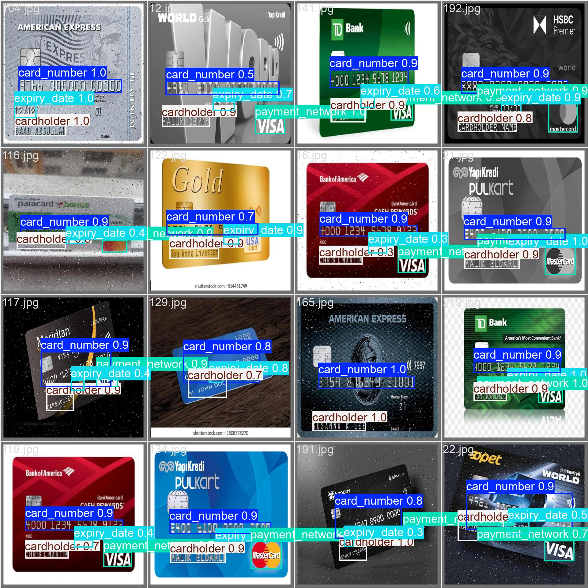

= **YOLOv10 Model Optimization for Credit Card Elements Detection**

== **1 Introduction**
This report show the processand results about **YOLOv10** Fine-TUnning for credit card element detections on images.
One of the main objectives of this project was to adapt **YOLOv10** model, that originally has not been trained to detect these elements from a credit card, previously detected by another **YOLOv10** Fine Tunning for this task (more information in link:https://github.com/nahueltabasso/yolo-fine-tunning/blob/main/docs/REPORT.adoc[Credit Card Model Detection]), in this step the task of our fine-tunned model is find and locate the elements of card in different conditions and environments.

=== **1.1 Context of Project**
This idea for make a fine-tunning of a **YOLO** model is relationed to the intention of improve the performance of this link:https://github.com/nahueltabasso/credit-card-service[Credit-Card-Service V1.0.0] on inference over images.
In other hand, this experiment is the continuation of the first fine tunning for the detection of credit cards, in this case we are trying to detect the different elements from it.
And finally the main idea is to process the entire process locally without the need to use an external service.

=== **1.2 Goals**
The main goal of this job is the detection of elements from credit cards in images.
Other goal is improve inference and processing time.

=== **1.3 Scope**

The scope of this project of **YOLOv10** Fine-Tunning for credit card elements detections includes the follows aspects:

* **Elements to detect:** This model has been trained to identify and locate four specific elements on credit cards: Card Number - CardHolder - Expiry Date - Payment Network (e.g Visa, Mastercard, American Express, Cabal)

* **Types of cards:** The model is designed to work with credit and debit cards from major international and national payment networks.

* **Image Conditions:** The model is optimized for card images captured in a variety of lighting conditions, from natural light to artificial lighting. It has been trained to handle different capture angles, including frontal views and slight tilts.

* **Performance:** The model is expected to achieve a mean accuracy (mAP) of at least 85 on a test set. The target inference time is less than 1000ms per image on standar GPU hardware. Also is expected to work very well in CPU.

* **Limitations:** The model is not designed to detect these elements in severely damaged cards. **CVV/CVC** code detection is not included for security reasons. The model does not perform OCR of detected items.

* **Ethical and privacy considerations:** The final model does not store or transmit sensitive information from the processed cards. 

== **2 Metodology**

=== **2.1 Data Set**

* **Size of dataset:** The dataset used for this Fine-Tunning has a 575 images, 500 of these were obtained from link:https://universe.roboflow.com/osr/credit_card_row[RoboFlow] and the other 75 images were taken or collected by me.

* **Annotations:** I used **CVAT** to note the missing labels and fix the wrong annotations.

* **Data Preprocessing:** It is used **FiftyOne** to manage and filter data.

==== **Some examples from Dataset**
[horizontal]
++++

    

++++

==== **2.2 Fine-Tunning Process**

1- Collect a balanced dataset of images, that includes different situations. e.g: Many cards in a same picture, different angles or perspectives, different light conditions, etc. 

2- Merge the collected dataset by me with a RoboFlow dataset using `genereateDataset_zoneDetection.py`.

3- Load dataset to **FiftyOne**.

4- Selection and tag of samples to fix with `fix_ann` tag.

5- Export labeled samples to **CVAT** for detailed correction and note the missing labels.

6- Manual correction of annotations in **CVAT**.

7- Import these corrected annotations to **FiftyOne** again.

8- Verify the corrected samples again.

9- Export dataset from **FiftyOne** with a **YOLO** format.

10- Split dataset in train_set, val_set and test_set.

10- Make a Fine-Tunning to **YOLOv10** using prepared dataset in the previous steps.

== **3 Results**

Evaluating rigorously the performance of our fine-tunned **YOLOv10** model for credit card elements detections is critical to understand its effectiveness and areas for potential improvement. In this section, present a detailed analysis of the results obtained through various evaluation metrics and visualizations.

**The results presented below:**

* **General Performance Metrics:** include metrics such as maP (mean Average Precision) with different thresholds of IoU (Intersection over Union), that permits evaluating the general precision of the model in the detection task.

* **Class Metrics:** Our model focuses on the detection of four classes (card_number, expiry_date, cardholder, payment_network), so detailed metrics such as precision, recall and F1-score are shown for these classes.

* **Confusion Matrix:** This visual tool helps us to undestand the patterns of success and error of the model, to provide important information about its performance in different scenes.

=== **3.1 Performance Metrics**

Belot it shows main performance metrics obtained from our fine-tunned model

After 100 training epochs completed, our **YOLOv10** fine-tunned model shows the follows results in  the validation test

++++
<table style="width: 100%; border-collapse: collapse; text-align: center; font-family: Arial, sans-serif;">
  <thead>
    <tr style="background-color: #f2f2f2; font-weight: bold;">
      <th style="padding: 10px; border-bottom: 2px solid #ddd;">Classes</th>
      <th style="padding: 10px; border-bottom: 2px solid #ddd;">Images</th>
      <th style="padding: 10px; border-bottom: 2px solid #ddd;">Instances</th>
      <th style="padding: 10px; border-bottom: 2px solid #ddd;">Box(P)</th>
      <th style="padding: 10px; border-bottom: 2px solid #ddd;">R</th>
      <th style="padding: 10px; border-bottom: 2px solid #ddd;">mAP50</th>
      <th style="padding: 10px; border-bottom: 2px solid #ddd;">mAP50-95</th>
    </tr>
  </thead>
  <tbody>
    <tr>
      <td style="padding: 10px; border-bottom: 1px solid #ddd;">All</td>
      <td style="padding: 10px; border-bottom: 1px solid #ddd;">57</td>
      <td style="padding: 10px; border-bottom: 1px solid #ddd;">214</td>
      <td style="padding: 10px; border-bottom: 1px solid #ddd;">0.971</td>
      <td style="padding: 10px; border-bottom: 1px solid #ddd;">0.926</td>
      <td style="padding: 10px; border-bottom: 1px solid #ddd;">0.980</td>
      <td style="padding: 10px; border-bottom: 1px solid #ddd;">0.862</td>
    </tr>
    <tr>
      <td style="padding: 10px; border-bottom: 1px solid #ddd;">Card Number</td>
      <td style="padding: 10px; border-bottom: 1px solid #ddd;">57</td>
      <td style="padding: 10px; border-bottom: 1px solid #ddd;">57</td>
      <td style="padding: 10px; border-bottom: 1px solid #ddd;">1.000</td>
      <td style="padding: 10px; border-bottom: 1px solid #ddd;">0.948</td>
      <td style="padding: 10px; border-bottom: 1px solid #ddd;">0.993</td>
      <td style="padding: 10px; border-bottom: 1px solid #ddd;">0.882</td>
    </tr>
    <tr>
      <td style="padding: 10px; border-bottom: 1px solid #ddd;">Expiry Date</td>
      <td style="padding: 10px; border-bottom: 1px solid #ddd;">55</td>
      <td style="padding: 10px; border-bottom: 1px solid #ddd;">55</td>
      <td style="padding: 10px; border-bottom: 1px solid #ddd;">0.945</td>
      <td style="padding: 10px; border-bottom: 1px solid #ddd;">0.909</td>
      <td style="padding: 10px; border-bottom: 1px solid #ddd;">0.967</td>
      <td style="padding: 10px; border-bottom: 1px solid #ddd;">0.822</td>
    </tr>
    <tr>
      <td style="padding: 10px; border-bottom: 1px solid #ddd;">Card Holder</td>
      <td style="padding: 10px; border-bottom: 1px solid #ddd;">54</td>
      <td style="padding: 10px; border-bottom: 1px solid #ddd;">54</td>
      <td style="padding: 10px; border-bottom: 1px solid #ddd;">0.985</td>
      <td style="padding: 10px; border-bottom: 1px solid #ddd;">0.889</td>
      <td style="padding: 10px; border-bottom: 1px solid #ddd;">0.986</td>
      <td style="padding: 10px; border-bottom: 1px solid #ddd;">0.867</td>
    </tr>
    <tr>
      <td style="padding: 10px; border-bottom: 1px solid #ddd;">Payment Network</td>
      <td style="padding: 10px; border-bottom: 1px solid #ddd;">47</td>
      <td style="padding: 10px; border-bottom: 1px solid #ddd;">48</td>
      <td style="padding: 10px; border-bottom: 1px solid #ddd;">0.953</td>
      <td style="padding: 10px; border-bottom: 1px solid #ddd;">0.958</td>
      <td style="padding: 10px; border-bottom: 1px solid #ddd;">0.976</td>
      <td style="padding: 10px; border-bottom: 1px solid #ddd;">0.878</td>
    </tr>
  </tbody>
</table>
++++

=== **3.2 Results Interpretation**

* **General Performance:** mAP50: 0.980, this indicates an excelent precision in the object detection. mAP50-95: 0.862, show a very good performance in a more estrict range of IoU.

* **Performance by class:** The `Card Number` class shows the best performance with a mAP50 equal to 0.993. The `Expiration Date` class has the lowest mAP50 (0.822), suggesting that this item is the most difficult to detect with high accuracy.

* **Precision and Recall:** The general precision (Box(P)) is very high (0.971), indicating a few false positives.  The recall is 0.926 and shows that our model detects the vast majority of the elements present.

=== **3.3 Precision-Confidence interpretation**

++++

    

        
    

++++

The curve of confidence or precision shows how model accuracy varies with different confidence levels.

**Some interpretations**

* All classes show a increasing trend, indicating that the accuracy improve with high confidence levels.
* The classes `Card Number` and `Cardholder` have perfect accuracy faster than the other classes.
* `Expiry Date` show the lowest curve, suggesting that is the more difficult element to predict with a high accuracy.

=== **3.4 Recall-Confidence interpretation**

++++

    

        
    

++++

* All classes remain a high recall (near to 1) until a confidence level of 0.6
* `Card Number` class shows the best performance, remain a high recall use with high confidence levels.
* `Expiry Date` class is the most challeging, with a steeper decline in recall as confidence increase.

=== **3.4 F1-Score interpretation**

++++

    

        
    

++++

This curve shows the balance between precision and recall at different confidence levels.

* All classes reach their maximun F1-Score in the confidence range of 0.4 to 0.6.
* `Card Number` class remains its F1-Score higher in a wider range of confidence 
levels.
* `Expiry Date` shows the steepest drop in F1-score at higher confidence levels, consistent with previous observations.
*  The model reachesa maximun F1-Score of 0.95 for all classes with a threshold of confidence aproximally of 0.5, suggesting a good balance between precision and recall.

=== **3.5 Confusion Matrix**

++++

    

        
    

++++

* The main diagonal shows a high number of correct predictions for all classes, indicating good overall performance.
* `Card Number` has the most quantity of correct predictions and any confusion with other class.
* `Espiry Date` shows the most number of false positives, consistent with its slightly lower performance in other metrics.
* There are a few quantity of confusion between classes and background, suggesting that the model occasionally can not detect the elements or detect false positives.

=== **3.6 Inference Speed**
The model shows an efficient perfomance on speed terms:

* **Pre-Processing:** 0.1ms per image
* **Inference:** 2.0ms per image
* **Post-Processing:** 0.1ms per image

**Total time:** 2.2ms, this allow processing aproximally 454 images per second.

=== **3.7 Model Summary**

* **Archirecture:** YOLOv10n
* **Layers:** 285
* **Parameters:** 2.695.976
* **GFLOPs:** 8.2

=== **3.8 Example of Validation Batch**

[cols="2*a", frame=none, grid=none]
|===
|.Labels

|.Predictions

|===

== **4 Conclusions and future work**

* **General Perfomance:** The model shows an excellent performance in all metrics,
with a high precision, recall and F1-Score for all classes.
* **Card Number Detection:** Is the element with best performance, showing a high precision and recal in all confidence levels.
* **Expiry Date Detection:** is the element more difficult to work, with slightly lower performance in all metrics. This could be due to variability in date formats or lower visibility of this element on some cards. 
* **Precision-Recall Balance:** The model reaches a good balance between precision and recall, with a maximun F1-Score of 0.95 for all classes.
* **Robustness:** The confusion matrix shows that the model rarely confuses classes with each other, indicating a good ability to distinguish between different card elements.

These metrics and graphics confirm a hihg performance of **YOLOv10** fine-tunned model for the credit/debit card elements detection. However shows some area for a potential improvement, particulary in the expiry date detection.

=== **4.1 Improvement areas**

* Improve the detections of expiry date element in credit cards.
* Experiment with different Data Augmentation techniques.

== **5 References**

1. link:https://docs.ultralytics.com/es/models/yolov10/[YOLOv10]
2. link:https://docs.voxel51.com/api/fiftyone.html[FiftyOne]
3. link:https://www.cvat.ai/[CVAT]