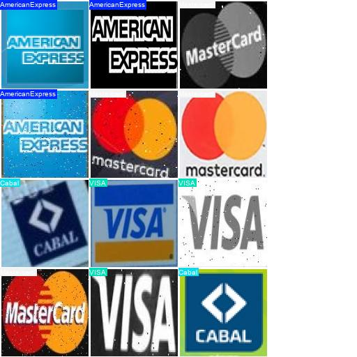

= **YOLOv10 Model Optimization for Payment Networks Classification**

== **Introduction**

This report shows the process and results about **YOLOv10** Fine-Tunning for Payment Networks classfication on images.

The fine-tuned model classifies the credit card payment network, which is detected using link:https://github.com/nahueltabasso/yolo-fine-tunning/blob/main/docs/cardZoneDetectionsDocs/REPORT.adoc[YOLOv10_CreditCardElementDetector] in a previous step, and determines whether the card is a VISA, Mastercard, American Express, or Cabal card.

=== **1.1 Motivation**

This third research project is the last part of the pipeline for the second version of link:https://github.com/nahueltabasso/credit-card-service[Credit-Card-Service]. So the objective of this fine-tunning is that the model aquires the skill to determines the Payment Network of a Credit/Debit card to incorporate this to the second version.

=== **1.2 Context and Challenges**

The idea and objective of this **YOLO** classifier is to be able to classify the following most used payment networks in Argentina:
* VISA
* MasterCard
* American Express
* Cabal

So currently, is outside of the scope of this project other payment networks from other parts of the world as European countries, USA, China, etc.

This task for payment network classification involves many challenges:

* **Little amount of data:** Specifically, we find few real examples of payment networks such as American Express and Cabal.
* **Simple characteristics:** The logos of payment networks that we will use in this project have simple characteristics, which can also produce a rapid generalization of these characteristics by the model or produce an overfitting.

== **2 Metodology**

=== **2.1 Data Set**

To do this task, I used a public dataset from link:https://universe.roboflow.com/efe-efesefe-gvfaz/credit-cards-n4hrw[RoboFlow]. 

In order to clean this dataset, a script was created to be able to cut out the payment network by extracting it using the model of link:https://github.com/nahueltabasso/yolo-fine-tunning/blob/main/docs/cardZoneDetectionsDocs/REPORT.adoc[YOLOv10_CreditCardElementDetector]. After that, the images were resized to a size of 128x128. But in this point I had a very unbalanced dataset because I had 274 images of the VISA class, 173 of the Mastercard class, 11 of the American Express class and 2 of Cabal.

[horizontal]
++++

     

++++

This is normal because the dataset I started from had approximately 575 images, and in general, the most used payment networks in Argentina and in the word are VISA or Mastercard. The first step to balanced this, it was collecting real cases and examples from different places (Internet, photos of cards) from American Express and Cabal. 

Then, I applied data augmentation techniques to classes, in there were few examples, such as:

* Image rotation
* Convert to gray scale
* Horizontal flip
* Contrast changes
* Adding noice
* Perspective changes

After applying these techniques, we have a more balanced dataset:

[horizontal]
++++

     

++++

So our final dataset has 809 images about our four Payments Network, with a distribution as shown above.

The table below shows the distribution of our data in the `train`, `val` and `test` set

[cols="1,1,1,1", options="header"]
|===
| Clase          | Train | Val | Test
| VISA           | 220   | 27  | 27
| MasterCard     | 138   | 18  | 17
| American Express| 136   | 20  | 21
| Cabal          | 163   | 11  | 11
|===

++++

    
<strong>Nota:</strong>

    <ul>
        <li>In the dataset of <b>validation</b> and <b>testing</b> only included real cases of the classes</li>
        <li>The image generated from the data augmentation were used for training only</li>
    </ul>

++++

== **3 Results**

After a rigorously evaluation about the performance of our fine-tuned YOLOv10 model for Payment Network classification, some conclusions have been dran from the metrics obtained, and how to improve it.

With our current dataset, our model yields a precision metrics of 100%. This result may be due to several reasons that I will mention below:

* Our classes have simple characteristics that is possible that a powerfull model as YOLOv10-N to learn and generalize them quickly despite the small amount of data.

* Possible overfitting, this may be due to the characteristics between the training and test data being similar.

=== **3.1 Confusion Matrix**

Below present a confusion matrix based on test set

++++

    

        
    

    
<strong>Confusion Matriz Interpretation:</strong>

    <ul>
        <li>Columns represent real classes</li>
        <li>Rows represent model predictions</li>
        <li>Numbers on the main diagonal indicate correct predictions</li>
        <li>Other numbers represent differents types of errors</li>
    </ul>

++++

This confusion matrix represents a perfect performance of our fine-tunned model in the test set. I previously mentioned the possible reasons for this behavior of the model.

=== **3. Example of Validation Batch**

[cols="2*a", frame=none, grid=none]
|===
|.Labels

|.Predictions

|===

== **4 Conclusions and future work**

The Fine-Tunning of **YOLOv10** for payment networks classification has shown good results, but the metrics of 100% accuracy in the test set is striking.

In order to validate the reliability of these metrics, more real data (real cases) from payment networks need to be collected in order to calculate the metrics again.

In this way, the percentage of synthetic data used in the training process can be reduced.

== **5 References**

1. link:https://docs.ultralytics.com/es/models/yolov10/[YOLOv10]
2. link:https://github.com/nahueltabasso/yolo-fine-tunning/blob/main/docs/cardZoneDetectionsDocs/REPORT.adoc[YOLOv10_CreditCardElementDetector]